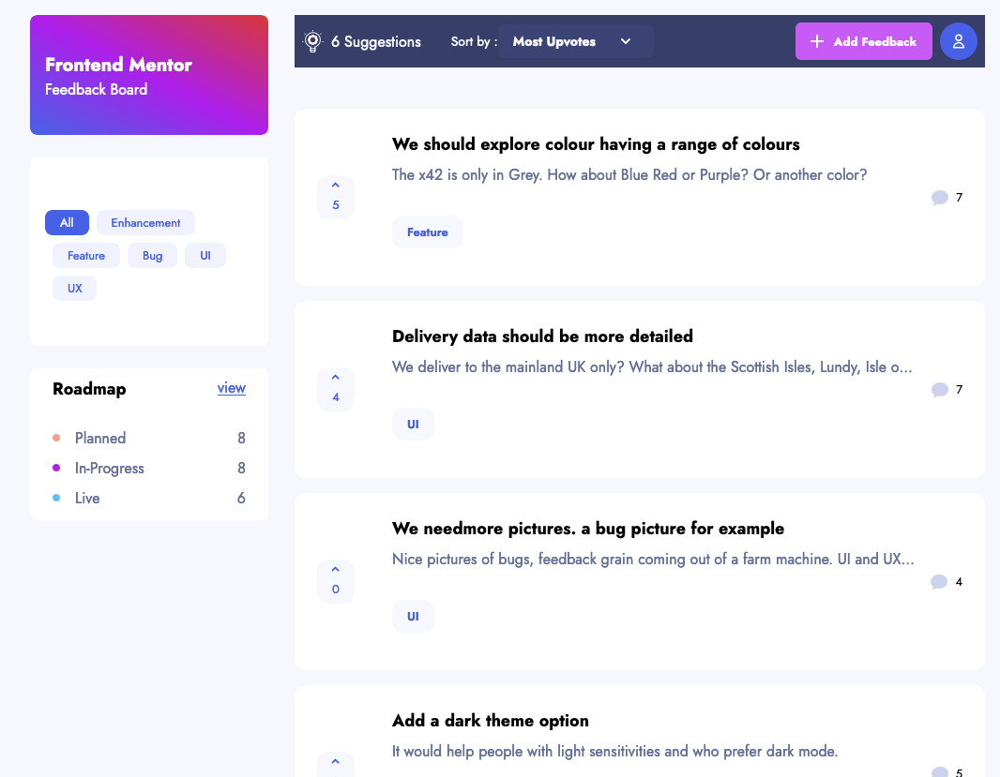

# README

# Product Feedback App

## Summary

Example Rails 6.1 application based around a [Frontend Mentor](https://www.frontendmentor.io/) design for a "[product feedback application](https://www.frontendmentor.io/challenges/product-feedback-app-wbvUYqjR6)". In addition to Rails 6.1 it uses Tailwindcss and Stimulus JS and tested with RSpec.

The product feedback App allows customers to give feedback about the application and then comment and vote on it. The app then allows staff members to select feedback and move it to the development roadmap, where it can be tracked through planned to live.

### Table of Contents
- [Requirements](docs/requirements.md)
- [Online demo](docs/online_demo.md)
- [Walkthrough](docs/walkthrough.md)
- [Getting Started](docs/getting_started.md)
- [Technical](docs/technical.md)
- [My process](docs/my_process.md)
