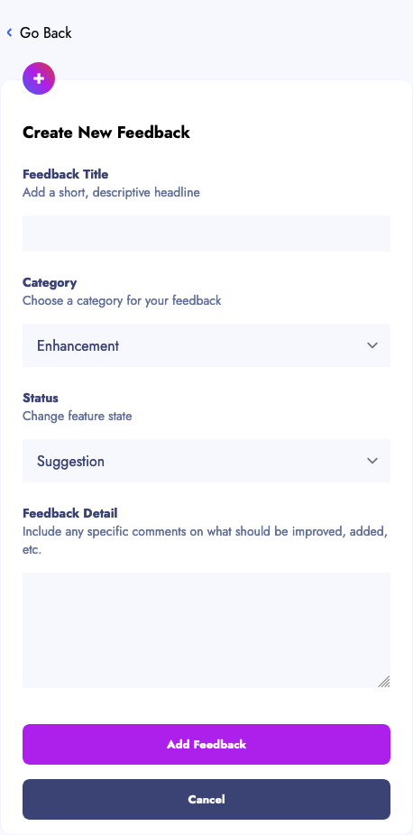

# Create

Create will "add feedback".

## Requirements

- the written requirement was simply to be able to create feedback.
- the visual requirement was that errors would appear underneath the relevant attribute.
- I have added the following requirements:
  - All the attributes are required
  - Title has a maximum of 120 characters
  - Description has a maximum of 150 characters

## Navigation

|Location | Name        |   Link            | Image
|:--------|:------------|:------------------|------
| Menu    | Go Back     |[Show](show.md) | | 
| Form    | Cancel      |[Show](show.md)    | 
| Form    | Add Feedback|[Show](show.md) | 
 

## Desktop

## Mobile

