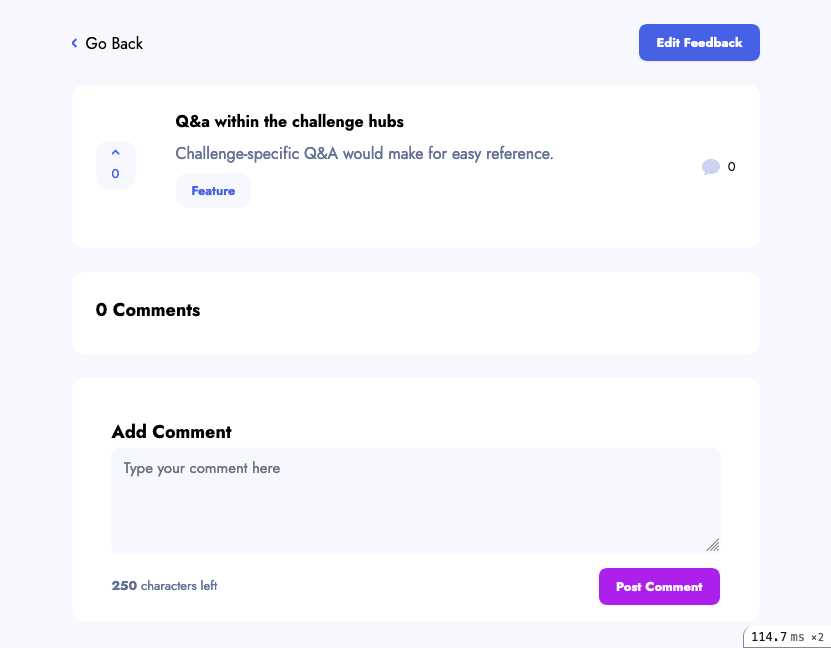
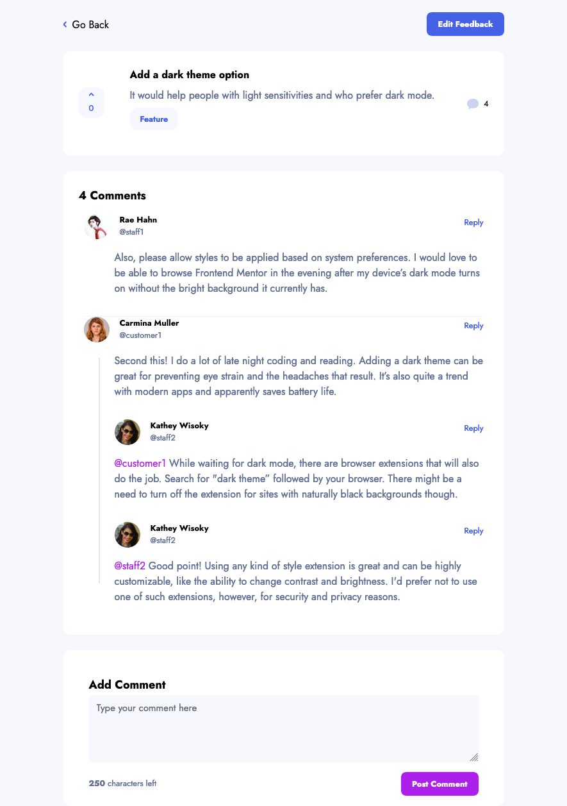
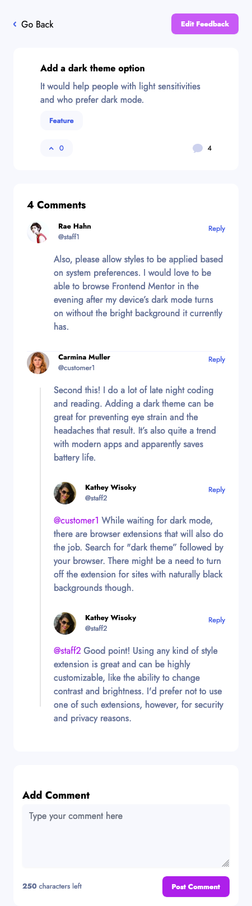

# Feedback Show

Show page gives the unrestricted title and description of the feedback. The page allows an authenticated reader to vote and, uniquely within the app, comment on the feedback.

## Show page without comments

## Navigation

|Location | Name          |   Link                      | Image
|:--------|:--------------|:----------------------------|-------------------------|
| Menu    | Go Back       | [Homepage](../homepage.md) or [Roadmap](../roadmap.md) *| | 
| Menu    | Edit Feedback | [Update](update.md)         | |
* Go Back will go back to homepage or roadmap depending on which you on last.
 

## Dynamic parts of page

## Dynamic parts of the page

|Location | Name                  | Information | Image        |
|:--------|:----------------------|:------------|:-------------|
| Main    | [Suggestion item](detailed/feedback_view_item.md) | [more ...](detailed/feedback_view_item.md) | |
| Main    | [Vote](detailed/vote.md) | [A signed in user can vote by clicking on a vote button. If they have not voted on a suggestion it appears light blue otherwise it is dark blue. More ..](detailed/vote.md) |   |

## Comment-thread

The requirements for the thread were given with a number of visual blueprints. They amounted to:

- an authenticated user can comment on feedback
- comments can have replies, and in turn a reply can have a reply.
  - there is no realistic limit to the *number* of replies.
  - reply is said to "nest" within the original comment and is given a nesting value of 1. A reply to a reply has a nesting of 2. A reply to a reply to a reply has a nesting of 3 and so on.
    - I added a maximum nesting limit of 8.
- Reply by clicking "Reply" which reveals a new empty text box for the reply to be entered.
- Comments without parents, which I call orphans, have a head element which is the commenter's information and everything else, the comment body and all replies, is offset and appears underneath *without any further offset* regardless of number of replies.
- Replies have the highlighted @username of the person you are replying to.
- Comments appear under person you reply. If there are more than one reply, it is ordered by who replied first.
- Comments must be a maximum of 250 characters long
  - I added a minimum characters limit of 3.

## Desktop

## Mobile

## Technical

Comment thread is made of two [view components](https://github.com/github/view_component). NewCommentComponent for adding comments. CommentComponent for displaying the comments using recursion.

Comment is a polymorphic association. This allows a comment to be associated with any other model. In this case it is only associated with feedbacks, however, commenting is such a common feature and it is so often used throughout the application that I preferred the slight cost of flexibility versus the simpler but less flexible one to many association.
