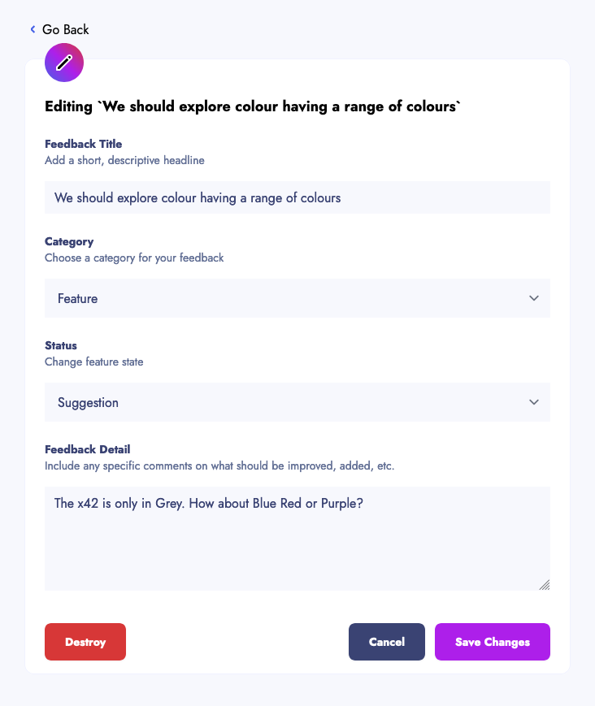
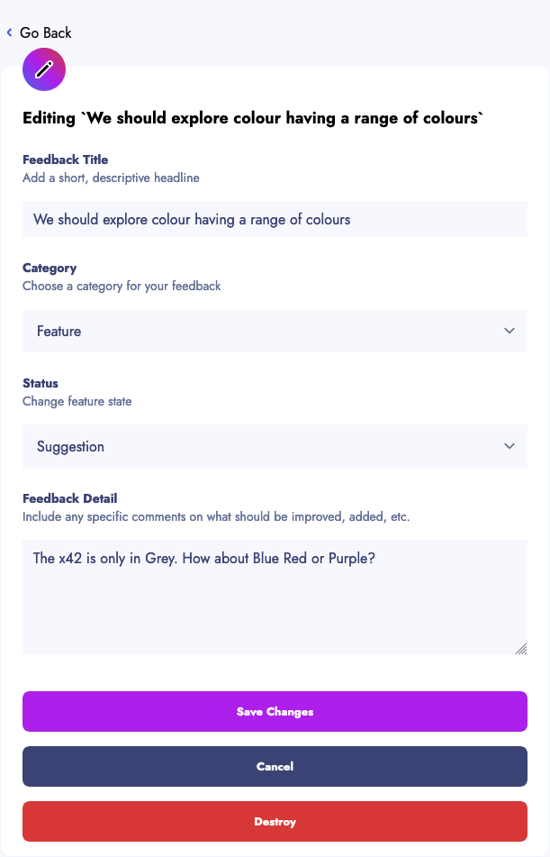

# Update

Update will change feedback.

## Requirements

- the written requirement was simply to be able to update feedback.
- the visual requirement was that errors would appear underneath the relevant attribute.
- I have added the following requirements:
  - All the attributes are required
  - Title has a maximum of 120 characters
  - Description has a maximum of 150 characters

## Navigation

|Location | Name        |   Link            | Image
|:--------|:------------|:------------------|------
| Menu    | Go Back     |[Show](show.md) | | 
| Form    | Destroy     |[Homepage](../homepage.md) | 
| Form    | Cancel      |[Show](show.md)    | 
| Form    | Save Changes|[Show](show.md)    | 

## Desktop

## Mobile

