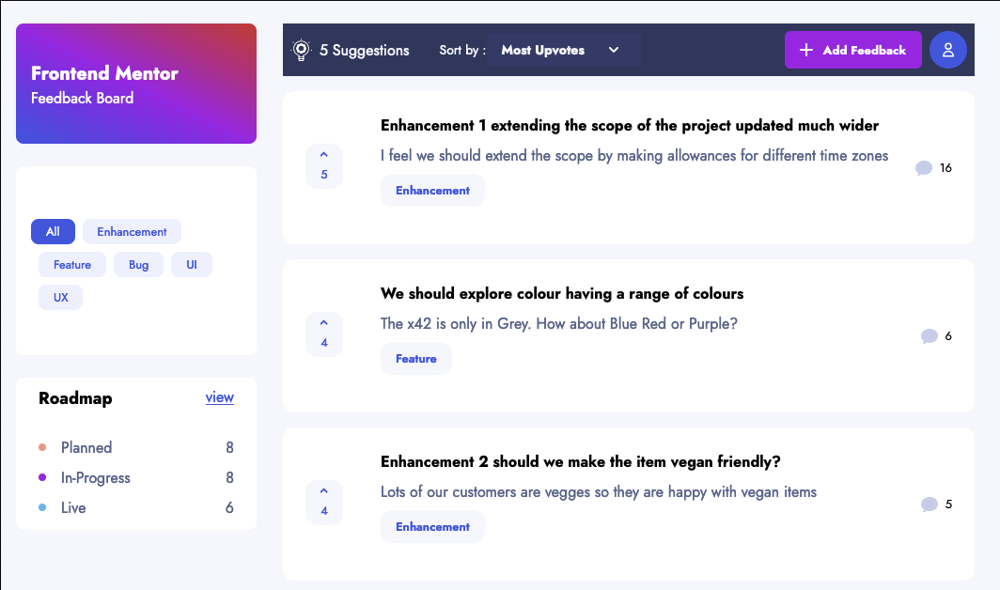
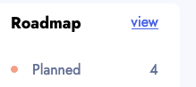
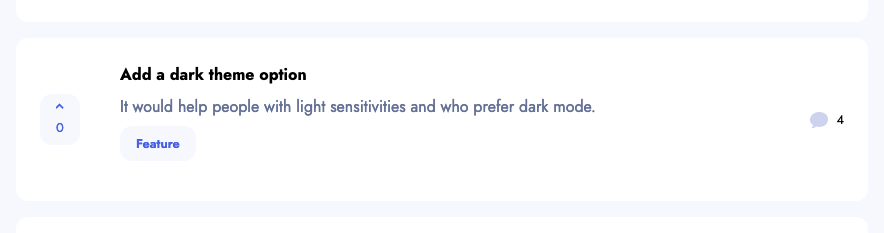
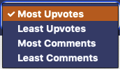
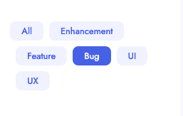
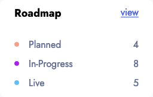
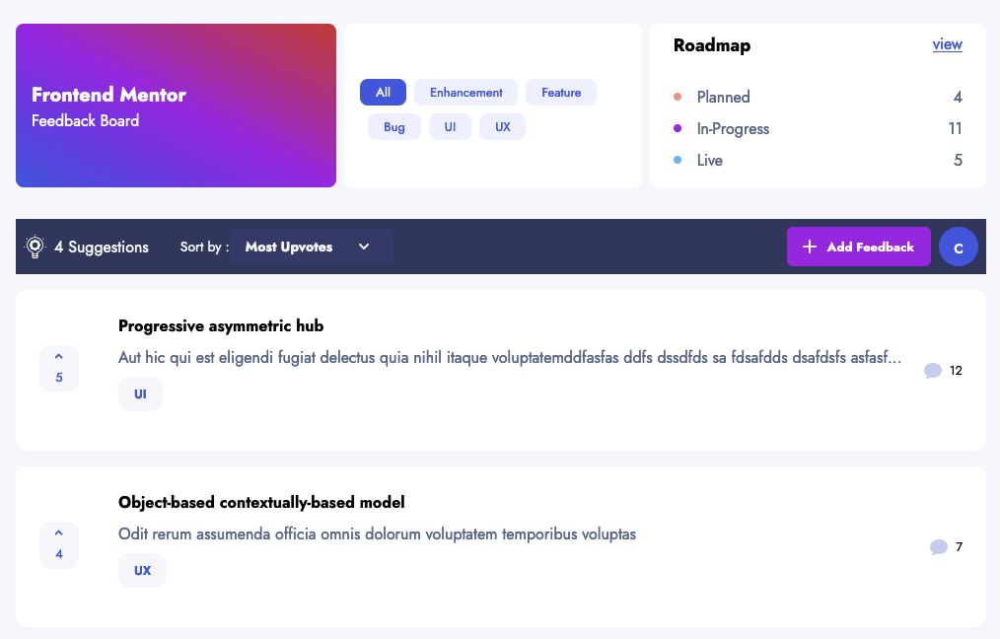
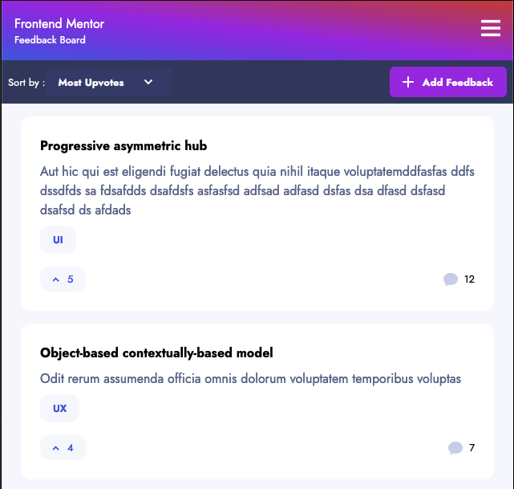
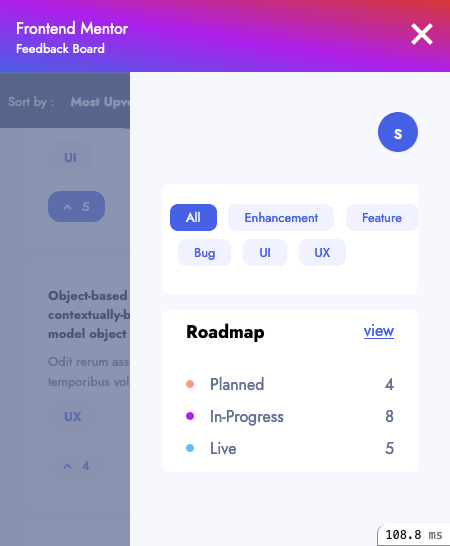

# Homepage

The home page provides a list of the suggestions for any visitor to see. They can see the number of votes and comments on any suggestion. Below is the desktop view of the homepage, but the [tablet view](#tablet) and [mobile view](#mobile) have the same options but rearranged differently.

### Desktop view of homepage

 
 

## Navigation

|Location | Name         |   Link            | Image
|:--------|:-------------|:------------------|------
| Menu    | Add feedback | [Create]](feedbacks/create.md) | 
| Menu    | Sign in / Sign out | | 
| Sidebar | View roadmap | [Roadmap](roadmap.md) | 
| Main    | View feedback| [Show](feedbacks/show.md)   | 

Note: I added the "blue circle" although there was no requirement to add any user account.

 
 

## Dynamic parts of page

|Location | Name                  | Information | Image        |
|:--------|:----------------------|:------------|:-------------|
| Menu    | Suggestions number    | Number of visible suggestions |    |
| Menu    | Sort by               | Sorting visible suggestions by both votes (most and least) and comments (most and least) are available through the dropdown.  |   |
| Sidebar | [Category filter](detailed/category_filter.md)       | [By selecting a category filter the homepage only shows suggestions in that category.  Categories are one of: All / Enhancement / Features / Bug / UI / UX.](detailed/category_filter.md)  |  |
| Sidebar | Roadmap    | Roadmap lists the number of suggestions that have made it into development and where they are in that development. |  |
| Main    | List suggestion item | Suggestions have a title and a discussion as well as a vote and comment count. |  |
| Main    | [Vote](detailed/vote.md) | [A signed in user can vote by clicking on a vote button. If they have not voted on a suggestion it appears light blue otherwise it is dark blue. More ..](detailed/vote.md) |   |

 

## Responsive views

This is a responsive design and part of the design moves around depending on the class of the view, mobile, tablet or desktop. Mobile design is up to 640px wide. Above that is tablet design, until 768px wide then finally desktop above that.

The application is responsive and includes a tablet and mobile in addition to the [already shown desktop version](#desktop-view-of-homepage).
## Tablet

## Mobile

