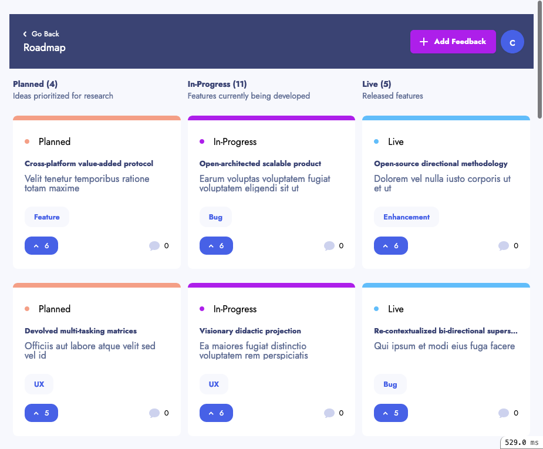
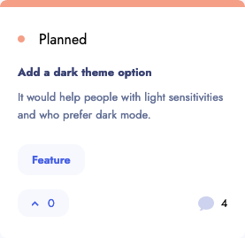
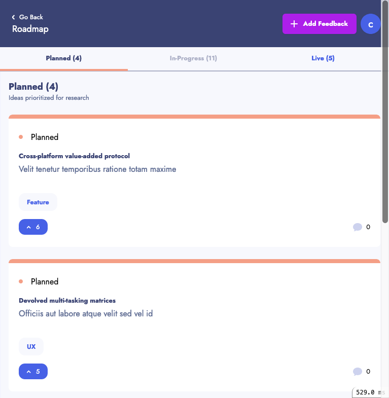

# Roadmap

When a suggestion is going to be developed, it is moved by a staff member to the Roadmap. The roadmap itself is divided into three lists ordered by votes: Planned, In-progress and Live.

Feedbacks are ordered by votes, there is no way to change this ordering.

Staff can move the feedback between columns by editing feedback and changing the status to one of Planned, In-Progress and Live (changing it to suggestion will move it from the Roadmap and back to the homepage where the suggestions are shown).

Below is the desktop view of the roadmap, but the [mobile view](#mobile) have the same options but rearranged differently.

### Desktop view of roadmap

## Navigation

|Location          | Name                 | Image
|------------------|----------------------|------
| Menu             | [Go Back](homepage.md) | 
| Menu             | [Add feedback](feedbacks/create.md) | 
| Menu             | Sign in / Sign out   | 
| Main             | [View feedback](./feedbacks/show.md)   | 

Note: I added the "blue circle" although there was no requirement to add any user account.

 
 

## Dynamic parts of the page

|Location | Name                  | Information | Image        |
|:--------|:----------------------|:------------|:-------------|
| Main    | [List suggestion item](detailed/feedback_view_item.md) | [3 lists of feedbacks. Planned / In-Progress and Live more ...](detailed/feedback_view_item.md) | |
| Main    | [Vote](detailed/vote.md) | [A signed in user can vote by clicking on a vote button. If they have not voted on a suggestion it appears light blue otherwise it is dark blue. More ..](detailed/vote.md) |   |

## Responsive views

The responsive views offer the same information but with different arrangements depending on the size of screen. The tablet size is very similar to desktop. The only interesting size is the mobile view below.

### Mobile view

